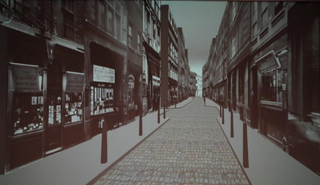

**MAP LOCALISATION USING COMPUTER VISION**

# **The task**
A museum is developing a virtual reality (VR) reconstruction of a region of London, showing how it appeared in about 1900 — see Figure 1. They want visitors to be able to place a pointer on a map of London and use the position and orientation of the pointer to determine the location and direction of the view in the reconstruction, as shown in Figure 2. 

Figure 1: VR reconstruction of Paternoster Row in London

The map to be used is Horwood’s hand-drawn one from about 1792. It is actually two of his maps joined together; pretty accurate for something hand-drawn that long ago.

Figure 2: Horwood’s map with blue background and red pointer; the view in Figure 1 corresponds to the location and direction of the pointer

In the museum, a camera is arranged above a dark blue table, looking directly downwards. The idea is that visitors put their copy of Horwood’s map roughly in the middle of the table and then place the red pointer on it. The people who are developing the exhibit clearly designed things with care to make the computer vision task easier: the lighting illuminates the table fairly uniformly, the light-coloured paper on which the map is printed is a good contrast to the dark background and the red pointer is a very different colour from the paper. The map has a green arrow showing the direction of north. The tip of the red pointer determines the viewpoint and the direction in which it is pointing determines the view direction; you have to print these out from your solution as detailed in Section 2. The general approach to the assignment should be fairly clear:

1. Segment the map from the blue background in the original image and extract it into a separate image in a way that makes the map edges match those of the extracted image.
1. Locate the green arrow and if it is not top-right of the map, rotate it through 180 degrees.
1. Segment the red pointer.
1. Locate the tip of the pointer to determine the location.
1. Determine the orientation of the pointer, convert it to a bearing and output it.

Figure 3: The coordinate system for the map
# **Operation**

The test images for running this code are stored in the Develop folder.

The solution can be run using the command:

python3 mapreader.py develop/develop-001.png

The program will output the filtered image of the map along with the values of the co-ordinates and the bearing angle of the pointer. The program is also designed to correct the orientation of the map if it is inverted. An example of input and corresponding output can be found in figure 4 and 5.

(More details about the working of the program have been explained with the code at:

[myprojects/mapreader.py at master · mishalkalladi/myprojects (github.com)](https://github.com/mishalkalladi/myprojects/blob/master/Computer%20Vision/Map%20Reader/mapreader.py))

*Figure 4    Develop-011 input (notice that the figure is inverted)*

*Figure 5 The corresponding output generated by the program (notice how the orientation has been corrected and the precise co-ordinates have been detected)*

4
